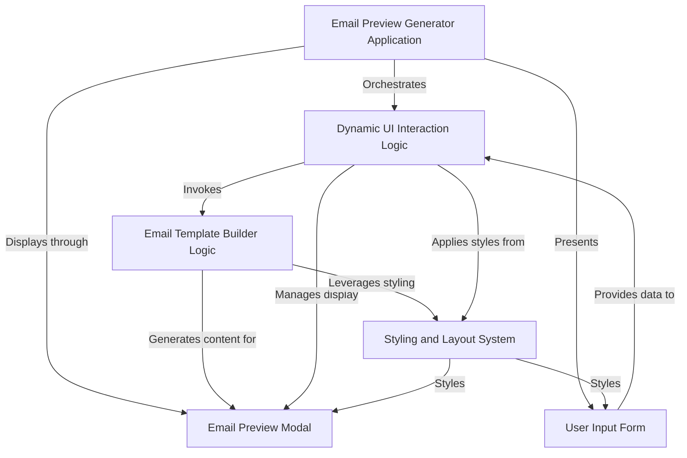

# Tutorial: EmailTemplatePreview

This project, `EmailTemplatePreview`, is a handy web application that lets you *quickly generate and preview* email templates. You simply **input the email subject and body content in both Arabic and English**, and it instantly shows you how the emails will look, complete with language-specific formatting, all within an interactive modal window.

## Visual Overview

## Chapters

1. [Email Preview Generator Application
](01_email_preview_generator_application_.md)
2. [User Input Form
](02_user_input_form_.md)
3. [Email Preview Modal
](03_email_preview_modal_.md)
4. [Dynamic UI Interaction Logic
](04_dynamic_ui_interaction_logic_.md)
5. [Email Template Builder Logic
](05_email_template_builder_logic_.md)
6. [Styling and Layout System
](06_styling_and_layout_system_.md)

---
