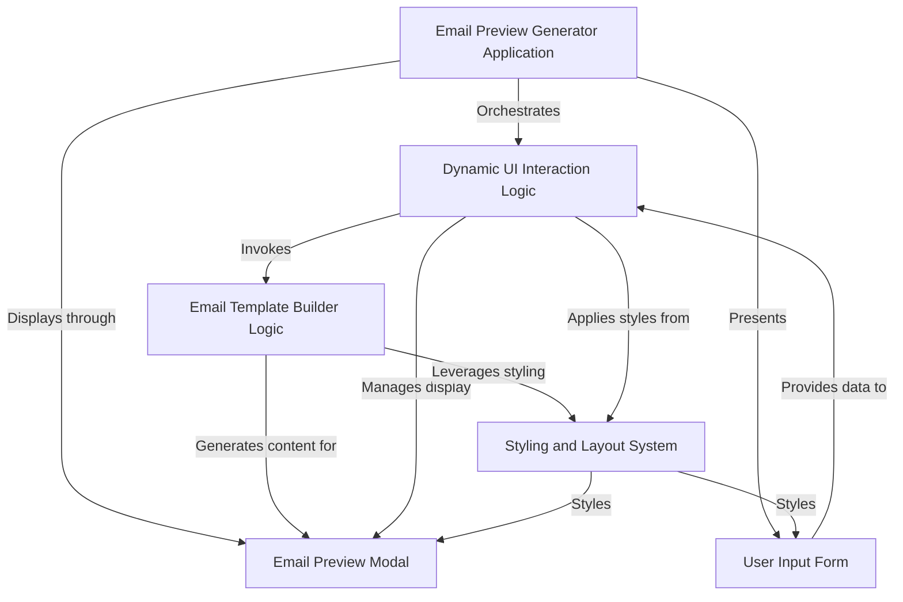
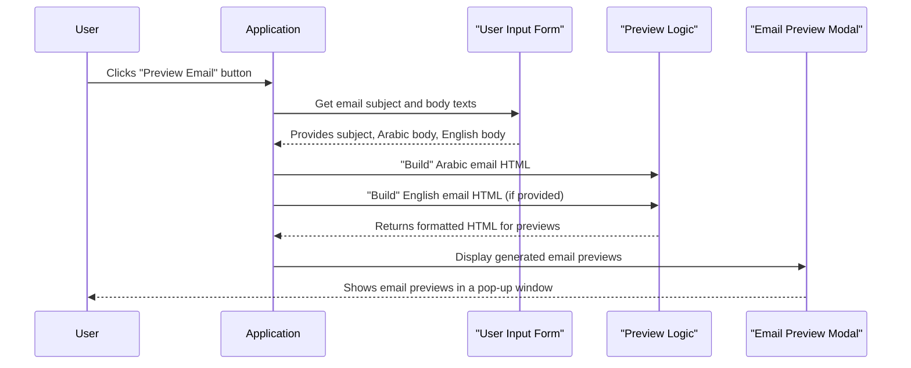

# Tutorial: EmailTemplatePreview

This project, `EmailTemplatePreview`, is a handy web application that lets you *quickly generate and preview* email templates. You simply **input the email subject and body content in both Arabic and English**, and it instantly shows you how the emails will look, complete with language-specific formatting, all within an interactive modal window.


## Visual Overview



## Chapters

1. [Email Preview Generator Application
](01_email_preview_generator_application_.md)
2. [User Input Form
](02_user_input_form_.md)
3. [Email Preview Modal
](03_email_preview_modal_.md)
4. [Dynamic UI Interaction Logic
](04_dynamic_ui_interaction_logic_.md)
5. [Email Template Builder Logic
](05_email_template_builder_logic_.md)
6. [Styling and Layout System
](06_styling_and_layout_system_.md)

---
# Chapter 1: Email Preview Generator Application

Welcome to the exciting world of `EmailTemplatePreview`! In this first chapter, we're going to explore the big picture: what our "Email Preview Generator Application" is all about.

### What Problem Are We Solving?

Have you ever sent an email, only to realize later that it didn't look quite right? Maybe the formatting was off, a link was broken, or it just didn't convey your message clearly? This can be especially tricky when you need to send emails in different languages, like Arabic and English, and want to make sure both versions look professional and consistent.

Imagine you're running a business and need to send out a special offer to your customers. You've written the message, but before hitting "Send All," you want to be absolutely sure it looks perfect on everyone's screen. You want to see how it will appear, check if the Arabic text flows correctly from right to left, and ensure the English version is equally well-presented.

This is where our **Email Preview Generator Application** comes to the rescue!

### What is the Email Preview Generator Application?

Think of the "Email Preview Generator Application" as your personal "all-in-one email studio." It's a complete web tool that lets you:

1.  **Write your email content:** You can type your subject, and the main message body in both Arabic and English.
2.  **See an instant preview:** With a single click, you can generate and view exactly how your email will look, side-by-side, for both languages.
3.  **Review and refine:** You can easily spot any issues, make changes, and preview again until everything is perfect, all before sending the actual email.

It brings together everything needed for crafting and reviewing email templates, providing a full experience from your initial idea to a visual draft.

### How Does It Work (A Simple Use Case)?

Let's walk through a simple scenario to understand how you'd use this application.

**Our Goal:** Generate a preview for an email with a subject and body text in both Arabic and English.

1.  **Open the Application:** You start by opening the application in your web browser. It looks like a simple webpage with some input boxes.

    ```html
    <body>
        <div class="container">
            <h3 class="text-center mb-4">📧 Email Preview Generator</h3>

            <!-- Input Form -->
            <div class="card shadow-sm p-4 mb-5">
                <!-- ... input fields will go here ... -->
            </div>
        </div>
        <!-- ... the rest of the page ... -->
    </body>
    ```
    *This small piece of code shows the basic structure of our page. It's like the main "canvas" where everything else will be placed.*

2.  **Input Your Email Details:** You'll see text boxes where you can type.

    *   **Email Subject:** "Exciting New Offer!"
    *   **Arabic Email Body:** "مرحبًا! لدينا عرض جديد ومثير لك." (Hello! We have an exciting new offer for you.)
    *   **English Email Body:** "Hi there! We have an exciting new offer for you."

    These inputs are part of what we call the [User Input Form](02_user_input_form_.md). Here's what those input boxes look like in our application:

    ```html
    <div class="mb-3">
        <label for="emailSubject" class="form-label fw-semibold">Email Subject</label>
        <input type="text" class="form-control" id="emailSubject" placeholder="Enter email subject">
    </div>

    <div class="mb-3">
        <label for="bodyArabic" class="form-label fw-semibold">Arabic Email Body</label>
        <textarea id="bodyArabic" class="form-control" rows="4" placeholder="اكتب نص البريد الإلكتروني بالعربية هنا"></textarea>
    </div>

    <div class="mb-3">
        <label for="bodyEnglish" class="form-label fw-semibold">English Email Body</label>
        <textarea id="bodyEnglish" class="form-control" rows="4" placeholder="Write the English email body here"></textarea>
    </div>
    ```
    *This HTML code creates the three text fields you see on the page for the subject, Arabic body, and English body.*

3.  **Click "Preview Email":** Once you've typed in your content, you click the "Preview Email" button.

    ```html
    <div class="text-center">
        <button id="btnPreviewEmail" class="btn btn-primary px-5">Preview Email</button>
    </div>
    ```
    *This is the HTML for our "Preview Email" button. When you click it, the application springs into action!*

4.  **View the Preview:** A large pop-up window (called a modal) appears. This is our [Email Preview Modal](03_email_preview_modal_.md). Inside, you'll see two separate boxes: one showing the Arabic email formatted beautifully, and the other showing the English email, also nicely formatted. You can then check everything and close the modal.

### What Happens "Under the Hood" (Internal Implementation)?

Let's peek behind the curtain to understand the basic steps the application takes when you click that "Preview Email" button.

#### Step-by-Step Walkthrough

Imagine you are the user and the application is like a helpful assistant:

1.  **You (User):** "I've typed my email details. Please show me a preview!" (You click the "Preview Email" button).
2.  **Application:** "Okay, let me get those details." It quickly reads the subject, Arabic body, and English body text that you typed into the input boxes.
3.  **Application:** "Now, let's make them look like real emails." It takes your plain text and uses a special process (we'll learn more about this in [Email Template Builder Logic](05_email_template_builder_logic_.md)) to wrap it in the proper HTML code, adding sender info, date, and a nice layout for both Arabic and English versions.
4.  **Application:** "Here are your previews!" It then takes these newly built email layouts and displays them inside a special pop-up window called the [Email Preview Modal](03_email_preview_modal_.md) for you to see.

Here's a simple diagram to visualize this flow:



#### The Code Behind the Magic

The core of this process in our `index.html` file uses JavaScript (specifically jQuery, which makes JavaScript easier to write).

First, the application waits for you to click the button:

```javascript
$(document).ready(function () {

    // This code runs when the page is fully loaded.

    // We tell the application to "listen" for clicks on the "btnPreviewEmail" button.
    $("#btnPreviewEmail").on("click", function () {
        // ... when the button is clicked, the code inside this function runs ...
    });

    // ... other parts of the application ...
});
```
*This JavaScript code ensures that when you click the button with the ID `btnPreviewEmail`, the instructions inside the function will be executed.*

Next, it gathers your input:

```javascript
// Inside the click function:
var subject = $("#emailSubject").val().trim(); // Get text from Subject box
var bodyAr = $("#bodyArabic").val().trim();   // Get text from Arabic Body box
var bodyEn = $("#bodyEnglish").val().trim(); // Get text from English Body box

if (!subject || !bodyAr) {
    alert("Please enter at least the subject and Arabic body.");
    return; // Stop if essential info is missing
}
```
*Here, the application grabs the text you typed into the input fields using their `id`s (like `emailSubject` or `bodyArabic`). The `.val()` gets the text, and `.trim()` removes any extra spaces at the beginning or end. It also checks if you've provided the minimum required information.*

After collecting your input, it uses a special function to create the email's look and feel, and then displays it:

```javascript
// This function takes your plain text and adds all the email formatting around it.
// (We'll look at the details of 'buildEmailTemplate' in Chapter 5!)
function buildEmailTemplate(subjectText, bodyText, isArabic = false) {
    // ... magic happens here to turn plain text into a nicely formatted email ...
    return `<!-- formatted email HTML -->`;
}

// Build HTML for both templates
var html = `
    <div class="email-preview-box">
        <h6 class="fw-bold text-primary mb-2 text-center">Arabic Template</h6>
        ${buildEmailTemplate(subject, bodyAr, true)}
    </div>
`;
// If English body is provided, add an English preview box too.
if (bodyEn) {
    html += `
        <div class="email-preview-box">
            <h6 class="fw-bold text-primary mb-2 text-center">English Template</h6>
            ${buildEmailTemplate(subject, bodyEn, false)}
        </div>
    `;
}

// Put the generated HTML into the preview container
$("#previewTemplatesContainer").html(html);

// Finally, show the pop-up window (modal) with the previews!
$("#emailPreviewModal").modal("show");
```
*This is the grand finale! The code uses the `buildEmailTemplate` function (which handles the complex task of styling) to create the actual HTML for your email previews. It then places this generated HTML into a special area (`#previewTemplatesContainer`) within our pop-up window, and finally, it makes the pop-up window visible to you.*

### Conclusion

In this chapter, we've learned that the "Email Preview Generator Application" is our complete tool for creating and reviewing email templates. We saw its main purpose: to help us visualize emails in both Arabic and English before sending them out. We also walked through a simple use case and got a sneak peek at the fundamental steps the application takes behind the scenes.

Next, we'll dive deeper into the first part of the application you interact with: the [User Input Form](02_user_input_form_.md).

---
