# Tutorial: EmailTemplatePreview

This project, `EmailTemplatePreview`, is a handy web application that lets you *quickly generate and preview* email templates. You simply **input the email subject and body content in both Arabic and English**, and it instantly shows you how the emails will look, complete with language-specific formatting, all within an interactive modal window.


## Visual Overview


## Chapters

1. [Email Preview Generator Application
](01_email_preview_generator_application_.md)
2. [User Input Form
](02_user_input_form_.md)
3. [Email Preview Modal
](03_email_preview_modal_.md)
4. [Dynamic UI Interaction Logic
](04_dynamic_ui_interaction_logic_.md)
5. [Email Template Builder Logic
](05_email_template_builder_logic_.md)
6. [Styling and Layout System
](06_styling_and_layout_system_.md)

---
# Chapter 1: Email Preview Generator Application

Welcome to the exciting world of `EmailTemplatePreview`! In this first chapter, we're going to explore the big picture: what our "Email Preview Generator Application" is all about.

### What Problem Are We Solving?

Have you ever sent an email, only to realize later that it didn't look quite right? Maybe the formatting was off, a link was broken, or it just didn't convey your message clearly? This can be especially tricky when you need to send emails in different languages, like Arabic and English, and want to make sure both versions look professional and consistent.

Imagine you're running a business and need to send out a special offer to your customers. You've written the message, but before hitting "Send All," you want to be absolutely sure it looks perfect on everyone's screen. You want to see how it will appear, check if the Arabic text flows correctly from right to left, and ensure the English version is equally well-presented.

This is where our **Email Preview Generator Application** comes to the rescue!

### What is the Email Preview Generator Application?

Think of the "Email Preview Generator Application" as your personal "all-in-one email studio." It's a complete web tool that lets you:

1.  **Write your email content:** You can type your subject, and the main message body in both Arabic and English.
2.  **See an instant preview:** With a single click, you can generate and view exactly how your email will look, side-by-side, for both languages.
3.  **Review and refine:** You can easily spot any issues, make changes, and preview again until everything is perfect, all before sending the actual email.

It brings together everything needed for crafting and reviewing email templates, providing a full experience from your initial idea to a visual draft.

### How Does It Work (A Simple Use Case)?

Let's walk through a simple scenario to understand how you'd use this application.

**Our Goal:** Generate a preview for an email with a subject and body text in both Arabic and English.

1.  **Open the Application:** You start by opening the application in your web browser. It looks like a simple webpage with some input boxes.

    ```html
    <body>
        <div class="container">
            <h3 class="text-center mb-4">📧 Email Preview Generator</h3>

            <!-- Input Form -->
            <div class="card shadow-sm p-4 mb-5">
                <!-- ... input fields will go here ... -->
            </div>
        </div>
        <!-- ... the rest of the page ... -->
    </body>
    ```
    *This small piece of code shows the basic structure of our page. It's like the main "canvas" where everything else will be placed.*

2.  **Input Your Email Details:** You'll see text boxes where you can type.

    *   **Email Subject:** "Exciting New Offer!"
    *   **Arabic Email Body:** "مرحبًا! لدينا عرض جديد ومثير لك." (Hello! We have an exciting new offer for you.)
    *   **English Email Body:** "Hi there! We have an exciting new offer for you."

    These inputs are part of what we call the [User Input Form](02_user_input_form_.md). Here's what those input boxes look like in our application:

    ```html
    <div class="mb-3">
        <label for="emailSubject" class="form-label fw-semibold">Email Subject</label>
        <input type="text" class="form-control" id="emailSubject" placeholder="Enter email subject">
    </div>

    <div class="mb-3">
        <label for="bodyArabic" class="form-label fw-semibold">Arabic Email Body</label>
        <textarea id="bodyArabic" class="form-control" rows="4" placeholder="اكتب نص البريد الإلكتروني بالعربية هنا"></textarea>
    </div>

    <div class="mb-3">
        <label for="bodyEnglish" class="form-label fw-semibold">English Email Body</label>
        <textarea id="bodyEnglish" class="form-control" rows="4" placeholder="Write the English email body here"></textarea>
    </div>
    ```
    *This HTML code creates the three text fields you see on the page for the subject, Arabic body, and English body.*

3.  **Click "Preview Email":** Once you've typed in your content, you click the "Preview Email" button.

    ```html
    <div class="text-center">
        <button id="btnPreviewEmail" class="btn btn-primary px-5">Preview Email</button>
    </div>
    ```
    *This is the HTML for our "Preview Email" button. When you click it, the application springs into action!*

4.  **View the Preview:** A large pop-up window (called a modal) appears. This is our [Email Preview Modal](03_email_preview_modal_.md). Inside, you'll see two separate boxes: one showing the Arabic email formatted beautifully, and the other showing the English email, also nicely formatted. You can then check everything and close the modal.

### What Happens "Under the Hood" (Internal Implementation)?

Let's peek behind the curtain to understand the basic steps the application takes when you click that "Preview Email" button.

#### Step-by-Step Walkthrough

Imagine you are the user and the application is like a helpful assistant:

1.  **You (User):** "I've typed my email details. Please show me a preview!" (You click the "Preview Email" button).
2.  **Application:** "Okay, let me get those details." It quickly reads the subject, Arabic body, and English body text that you typed into the input boxes.
3.  **Application:** "Now, let's make them look like real emails." It takes your plain text and uses a special process (we'll learn more about this in [Email Template Builder Logic](05_email_template_builder_logic_.md)) to wrap it in the proper HTML code, adding sender info, date, and a nice layout for both Arabic and English versions.
4.  **Application:** "Here are your previews!" It then takes these newly built email layouts and displays them inside a special pop-up window called the [Email Preview Modal](03_email_preview_modal_.md) for you to see.

Here's a simple diagram to visualize this flow:


#### The Code Behind the Magic

The core of this process in our `index.html` file uses JavaScript (specifically jQuery, which makes JavaScript easier to write).

First, the application waits for you to click the button:

```javascript
$(document).ready(function () {

    // This code runs when the page is fully loaded.

    // We tell the application to "listen" for clicks on the "btnPreviewEmail" button.
    $("#btnPreviewEmail").on("click", function () {
        // ... when the button is clicked, the code inside this function runs ...
    });

    // ... other parts of the application ...
});
```
*This JavaScript code ensures that when you click the button with the ID `btnPreviewEmail`, the instructions inside the function will be executed.*

Next, it gathers your input:

```javascript
// Inside the click function:
var subject = $("#emailSubject").val().trim(); // Get text from Subject box
var bodyAr = $("#bodyArabic").val().trim();   // Get text from Arabic Body box
var bodyEn = $("#bodyEnglish").val().trim(); // Get text from English Body box

if (!subject || !bodyAr) {
    alert("Please enter at least the subject and Arabic body.");
    return; // Stop if essential info is missing
}
```
*Here, the application grabs the text you typed into the input fields using their `id`s (like `emailSubject` or `bodyArabic`). The `.val()` gets the text, and `.trim()` removes any extra spaces at the beginning or end. It also checks if you've provided the minimum required information.*

After collecting your input, it uses a special function to create the email's look and feel, and then displays it:

```javascript
// This function takes your plain text and adds all the email formatting around it.
// (We'll look at the details of 'buildEmailTemplate' in Chapter 5!)
function buildEmailTemplate(subjectText, bodyText, isArabic = false) {
    // ... magic happens here to turn plain text into a nicely formatted email ...
    return `<!-- formatted email HTML -->`;
}

// Build HTML for both templates
var html = `
    <div class="email-preview-box">
        <h6 class="fw-bold text-primary mb-2 text-center">Arabic Template</h6>
        ${buildEmailTemplate(subject, bodyAr, true)}
    </div>
`;
// If English body is provided, add an English preview box too.
if (bodyEn) {
    html += `
        <div class="email-preview-box">
            <h6 class="fw-bold text-primary mb-2 text-center">English Template</h6>
            ${buildEmailTemplate(subject, bodyEn, false)}
        </div>
    `;
}

// Put the generated HTML into the preview container
$("#previewTemplatesContainer").html(html);

// Finally, show the pop-up window (modal) with the previews!
$("#emailPreviewModal").modal("show");
```
*This is the grand finale! The code uses the `buildEmailTemplate` function (which handles the complex task of styling) to create the actual HTML for your email previews. It then places this generated HTML into a special area (`#previewTemplatesContainer`) within our pop-up window, and finally, it makes the pop-up window visible to you.*

### Conclusion

In this chapter, we've learned that the "Email Preview Generator Application" is our complete tool for creating and reviewing email templates. We saw its main purpose: to help us visualize emails in both Arabic and English before sending them out. We also walked through a simple use case and got a sneak peek at the fundamental steps the application takes behind the scenes.

Next, we'll dive deeper into the first part of the application you interact with: the [User Input Form](02_user_input_form_.md).

---
# Chapter 2: User Input Form

In [Chapter 1: Email Preview Generator Application](01_email_preview_generator_application_.md), we got a big-picture view of our `EmailTemplatePreview` application. We learned it's a tool to help us write and preview emails in different languages before we send them. Now, let's zoom in on the very first part you interact with: the **User Input Form**.

### What is the User Input Form?

Imagine you're at a restaurant, and you want to order a special meal. You don't just shout your order into the kitchen; you fill out an order form or tell your waiter exactly what you want. The **User Input Form** in our application is just like that order form!

Its job is simple but very important: it's the place where **you tell the application all the details about the email you want to preview.** Specifically, you'll type in:

1.  **The Email Subject:** What the email is generally about.
2.  **The Arabic Body Content:** The main message of your email, written in Arabic.
3.  **The English Body Content:** The same main message, but written in English.

It's the "data entry point" where you provide the raw text for your emails.

### Why Do We Need It?

Our application is designed to *generate* a preview. But it can't generate anything if it doesn't know *what* to generate! The User Input Form solves this problem by giving you a clear, easy way to provide all the necessary text. Without it, the application would be like an empty canvas – it needs your words to start drawing the email preview.

### How to Use the User Input Form

Using the form is very straightforward, just like typing into any text box on a website.

Let's walk through an example: You want to preview an email for a "New Product Launch."

1.  **Open the Application:** You launch `index.html` in your web browser. You'll see a section that looks like a form.

    ```html
    <!-- Input Form -->
    <div class="card shadow-sm p-4 mb-5">
        <!-- Input fields will be inside here -->
    </div>
    ```
    *This is the main container for our form. It's like the border around your "order form."*

2.  **Type in the Email Subject:** Find the box labeled "Email Subject."

    ```html
    <div class="mb-3">
        <label for="emailSubject" class="form-label fw-semibold">Email Subject</label>
        <input type="text" class="form-control" id="emailSubject" placeholder="Enter email subject">
    </div>
    ```
    *This piece of HTML creates the "Email Subject" input box. The `id="emailSubject"` is like a unique name tag for this box.*

    **Your Input:** You would type something like:
    `"🚀 Exciting New Product Launch!"`

3.  **Type in the Arabic Email Body:** Next, find the larger text area labeled "Arabic Email Body."

    ```html
    <div class="mb-3">
        <label for="bodyArabic" class="form-label fw-semibold">Arabic Email Body</label>
        <textarea id="bodyArabic" class="form-control" rows="4" placeholder="اكتب نص البريد الإلكتروني بالعربية هنا"></textarea>
    </div>
    ```
    *This creates the larger input box for your Arabic message. `id="bodyArabic"` is its unique name.*

    **Your Input:** You would type the Arabic version of your message, for example:
    `"مرحبًا! يسعدنا أن نعلن عن إطلاق منتجنا الجديد والمثير. اكتشف المزيد الآن!"`
    (Hello! We are excited to announce the launch of our new and exciting product. Discover more now!)

4.  **Type in the English Email Body:** Finally, locate the text area for the English content.

    ```html
    <div class="mb-3">
        <label for="bodyEnglish" class="form-label fw-semibold">English Email Body</label>
        <textarea id="bodyEnglish" class="form-control" rows="4" placeholder="Write the English email body here"></textarea>
    </div>
    ```
    *This is for your English message. `id="bodyEnglish"` is its unique name.*

    **Your Input:** You would type the English version:
    `"Hello! We're thrilled to announce the launch of our exciting new product. Discover more now!"`

Once you've filled in these three fields, your User Input Form is complete! The application now has all the raw text it needs to move to the next step: generating your previews.

### What Happens "Under the Hood"?

You see the input boxes, you type into them, and the text just stays there. But what happens when you click the "Preview Email" button? How does the application actually *get* the text you typed?

#### Step-by-Step Walkthrough

Let's imagine you've just finished typing your email content:

1.  **You (User):** You've entered all your text into the input boxes.
2.  **You (User):** You click the "Preview Email" button.
3.  **Application:** The moment you click, the application "wakes up" and knows it needs to gather the information you provided.
4.  **Application:** It acts like a detective, looking for specific elements on the page. It finds the input box with `id="emailSubject"`, the one with `id="bodyArabic"`, and the one with `id="bodyEnglish"`.
5.  **Application:** For each of these elements, it "reads" the text that you typed inside and stores it in its memory.

Here's a simple diagram to visualize this process:


```mermaid
sequenceDiagram
    participant User
    participant InputForm as "User Input Form"
    participant Application

    User->>InputForm: Types text into Subject
    User->>InputForm: Types text into Arabic Body
    User->>InputForm: Types text into English Body
    Note over User,InputForm: The form elements now hold the text

    User->>Application: Clicks "Preview Email" button

    Application->>InputForm: "Give me the text from 'emailSubject'!"
    InputForm-->>Application: "🚀 Exciting New Product Launch!"

    Application->>InputForm: "Give me the text from 'bodyArabic'!"
    InputForm-->>Application: "مرحبًا! يسعدنا أن نعلن..."

    Application->>InputForm: "Give me the text from 'bodyEnglish'!"
    InputForm-->>Application: "Hello! We're thrilled to announce..."
    Note over Application: Now the application has all the text to build previews.
```

*This diagram shows how the application asks the User Input Form for the text you've typed after you click the preview button.*

#### The Code Behind Getting Input

Let's look at the JavaScript code (found at the bottom of `index.html`) that performs this "reading" of your input. This code runs right after you click the "Preview Email" button.

```javascript
// This function runs when the "Preview Email" button is clicked.
$("#btnPreviewEmail").on("click", function () {

    // 1. Get the text from the Email Subject box
    var subject = $("#emailSubject").val().trim();

    // 2. Get the text from the Arabic Email Body box
    var bodyAr = $("#bodyArabic").val().trim();

    // 3. Get the text from the English Email Body box
    var bodyEn = $("#bodyEnglish").val().trim();

    // ... (rest of the code to build and show preview) ...
});
```
*This JavaScript code is the application's way of reading what you typed into the boxes. Let's break down what each line does:*

*   `$("#emailSubject")`: This part is like telling the application, "Go find the HTML element that has the `id` of 'emailSubject'." (Remember, that's our subject input box).
*   `.val()`: Once the element is found, `.val()` is a special command that says, "Give me the current text value inside this input box."
*   `.trim()`: This little helper simply removes any extra spaces you might accidentally type at the very beginning or end of your text. It keeps your input neat!
*   `var subject = ...`: This takes the cleaned-up text and stores it in a temporary storage space (a "variable" called `subject`) so the application can use it later.

The lines for `bodyAr` and `bodyEn` do the exact same thing but for the Arabic and English body text areas.

After these lines of code run, the application now has your email subject, Arabic body, and English body safely stored. It's ready for the next steps: taking this raw text and turning it into beautiful email previews!

### Conclusion

The **User Input Form** is your starting point in the `EmailTemplatePreview` application. It's the simple, interactive component where you provide all the essential text for your emails – the subject, and the body content in both Arabic and English. We saw how this form is built with basic HTML input fields and how, behind the scenes, JavaScript reads your typed content when you click the preview button.

Now that the application knows *what* you want to preview, the next step is to actually *show* you the preview. In the next chapter, we'll explore the [Email Preview Modal](03_email_preview_modal_.md), which is the pop-up window where your generated email templates will be displayed.

---
# Chapter 3: Email Preview Modal

In [Chapter 1: Email Preview Generator Application](01_email_preview_generator_application_.md), we learned about our application's big goal: to help us preview emails. In [Chapter 2: User Input Form](02_user_input_form_.md), we saw how you provide your email's subject and body text. But what happens *after* you've typed everything and clicked "Preview Email"? How do you actually *see* your beautifully crafted email?

This is where the **Email Preview Modal** comes in!

### What Problem Does It Solve?

Imagine you're an artist, and you've just finished painting a masterpiece. You wouldn't just leave it hidden in your studio; you'd want to display it for everyone to see! Similarly, after you've provided all your email text, our application needs a clear, dedicated space to showcase the generated email templates.

The **Email Preview Modal** solves this problem by providing that perfect "display case." It's a special pop-up window that appears right in front of your main application screen, specifically designed to show you what your email will look like. It allows you to review your email designs, check formatting, and ensure everything is perfect before you send it out.

### What is the Email Preview Modal?

Think of the "Email Preview Modal" as a **digital display case** that pops open to showcase your completed email designs.

Here are its key features:

*   **It's a Pop-Up Window (Modal):** Instead of taking you to a new page, it overlays the current one. This means you can easily close it and go back to editing your input without losing your place.
*   **Designed for Previewing:** Its main purpose is to show you the *final look* of your email.
*   **Side-by-Side View:** It provides a structured area where you can see both your Arabic and English email templates next to each other. This is super helpful for comparing and ensuring consistency.
*   **Scrollable Area:** Emails can be long! The modal's body is designed to be scrollable, so you can review every detail of your email, no matter its length.
*   **Full-Screen Option:** If you need more space to meticulously examine your email, you can expand the modal to fill your entire screen.

In short, it's the dedicated screen space for viewing the output of your [Email Template Builder Logic](05_email_template_builder_logic_.md).

### How to Use the Email Preview Modal

Using the Email Preview Modal is incredibly simple, as it's designed to appear automatically when you need it.

Let's continue with our "New Product Launch" example from [Chapter 2: User Input Form](02_user_input_form_.md):

1.  **Fill the Input Form:** You've typed your subject, Arabic body, and English body into the input fields.
2.  **Click "Preview Email":** You click the "Preview Email" button.

    ```html
    <div class="text-center">
        <button id="btnPreviewEmail" class="btn btn-primary px-5">Preview Email</button>
    </div>
    ```
    *This is the button that triggers the magic!*

3.  **The Modal Appears:** Instantly, a large pop-up window, our **Email Preview Modal**, slides into view on your screen.

    Inside this modal, you'll see something like this:

    *   A heading at the top: "Email Preview".
    *   Two distinct boxes:
        *   One box will be labeled "Arabic Template" and will show your Arabic email content (from `bodyArabic`) beautifully formatted, usually flowing from right-to-left.
        *   The second box will be labeled "English Template" and will show your English email content (from `bodyEnglish`) formatted nicely, flowing left-to-right.
    *   You'll also notice two small buttons in the header: one to "Expand" the modal to full screen (often an icon like `⛶` or `🗗`) and one to "Close" it (`X`).

    Now you can scroll, inspect, compare, and ensure everything looks exactly as you intended before your customers receive the actual email! When you're done, simply click the "X" button to close the modal.

### What Happens "Under the Hood"?

Let's peek behind the curtain to understand how the Email Preview Modal appears and displays your content.

#### Step-by-Step Walkthrough

Imagine the application as your assistant, following your instructions:

1.  **You (User):** "Show me the preview!" (You click the "Preview Email" button).
2.  **Application:** "Okay, let me get your text." It quickly gathers the subject, Arabic body, and English body from the [User Input Form](02_user_input_form_.md).
3.  **Application:** "Now, let's create the actual email look." It uses a special process (our [Email Template Builder Logic](05_email_template_builder_logic_.md)) to turn your plain text into formatted HTML code for both the Arabic and English emails.
4.  **Application:** "I have the finished email layouts. Time to put them in the display case." It takes the generated HTML code and inserts it into a specific placeholder area *inside* the Email Preview Modal.
5.  **Application:** "The display case is ready!" It then makes the Email Preview Modal visible on your screen.
6.  **Email Preview Modal:** "Here are your previews!" It displays the formatted Arabic and English emails for you to review.

Here's a simple diagram to visualize this process:


#### The Code Behind the Modal

The Email Preview Modal is primarily built using HTML and styled with CSS, while JavaScript (and jQuery) handles its behavior (showing, hiding, and expanding).

**1. The HTML Structure:**
The modal itself is a hidden section in our `index.html` file, waiting to be shown. It uses Bootstrap's modal components.

```html
<!-- Email Preview Modal -->
<div class="modal fade" id="emailPreviewModal" tabindex="-1" aria-labelledby="emailPreviewModalLabel" aria-hidden="true">
    <div class="modal-dialog modal-xl">
        <div class="modal-content">
            <!-- Header for title and buttons -->
            <div class="modal-header d-flex justify-content-between align-items-center position-relative">
                <div class="flex-grow-1 text-start">
                    <p class="modal-title fw-semibold m-0" id="emailPreviewModalLabel">Email Preview</p>
                </div>
                <!-- Expand button -->
                <button type="button" id="btnExpandModal" class="btn btn-sm btn-outline-secondary position-absolute top-50 start-50 translate-middle">
                    ⛶
                </button>
                <!-- Close button -->
                <button type="button" id="btnCloseModal" class="btn btn-sm btn-outline-secondary ms-auto" data-bs-dismiss="modal" aria-label="Close">
                    X
                </button>
            </div>

            <!-- Body where previews go -->
            <div class="modal-body bg-white" style="font-family:'Segoe UI', Tahoma, sans-serif; color:#333;">
                <div id="previewTemplatesContainer"></div>
            </div>
        </div>
    </div>
</div>
```
*   The `<div class="modal fade" id="emailPreviewModal">` is the main container for our pop-up window. `id="emailPreviewModal"` is its unique name.
*   `modal-dialog modal-xl` makes it a large modal by default.
*   `modal-content` is the actual box that contains the header and body.
*   `modal-header` contains the title ("Email Preview") and the "Expand" and "Close" buttons.
*   `modal-body` is the most important part for us – it's where our generated email previews will actually appear! The `div` with `id="previewTemplatesContainer"` is the specific spot inside the modal body where the Arabic and English email HTML will be injected.

**2. Basic Styling for the Modal:**
A small part of our `style` section in `index.html` ensures the modal looks good and functions correctly.

```css
#emailPreviewModal .modal-dialog {
    max-width: 95%; /* Make it wide */
    width: 95%;
}

#emailPreviewModal .modal-body {
    max-height: 85vh; /* Don't make it taller than 85% of screen */
    overflow-y: auto; /* Add scrollbar if content is too long */
}

.fullscreen-modal {
    max-width: 100% !important; /* Take full width when expanded */
    width: 100% !important;
    height: 100vh !important; /* Take full height when expanded */
    margin: 0;
}
/* ... other styling for buttons and layout ... */
```
*   These CSS rules make sure the modal is wide, its content is scrollable if needed, and there's a special `fullscreen-modal` class to make it expand to cover the whole screen.

**3. Showing the Modal with JavaScript:**
The JavaScript code we saw in Chapter 1 is responsible for taking the generated email content and making the modal appear. This code is found in the `script` section at the bottom of `index.html`.

```javascript
// This function runs when the "Preview Email" button is clicked.
$("#btnPreviewEmail").on("click", function () {
    // ... (code to get input and build HTML, as seen in Chapter 1) ...

    // 'html' variable holds the complete HTML for both Arabic and English previews.
    // We add this HTML to the specific container inside our modal.
    $("#previewTemplatesContainer").html(html);

    // Finally, this line makes the modal visible!
    $("#emailPreviewModal").modal("show");
});
```
*   `$("#previewTemplatesContainer").html(html);`: This line is like telling the application, "Find the element with `id='previewTemplatesContainer'` (which is inside our modal body) and put all the `html` code we just generated inside it."
*   `$("#emailPreviewModal").modal("show");`: This is a special command from Bootstrap (made easy with jQuery) that tells the modal with `id='emailPreviewModal'` to become visible on the screen.

**4. Expanding to Full Screen:**
The "Expand" button in the modal header also has a piece of JavaScript logic attached to it.

```javascript
// Expand / shrink modal toggle
$(document).on("click", "#btnExpandModal", function () {
    // Toggles the 'fullscreen-modal' CSS class on the modal-dialog.
    // This makes it switch between normal size and full screen.
    $("#emailPreviewModal .modal-dialog").toggleClass("fullscreen-modal");

    // Changes the button icon between 'expand' (⛶) and 'shrink' (🗗).
    $(this).text($(this).text() === "⛶" ? "🗗" : "⛶");
});
```
*   When `$("#btnExpandModal")` is clicked, the `toggleClass("fullscreen-modal")` command either adds or removes the `fullscreen-modal` CSS class to the modal's dialog. This is what changes its size.
*   The `.text(...)` line simply changes the button's symbol (`⛶` for expand, `🗗` for shrink) to match its current action.

### Conclusion

The **Email Preview Modal** is the dedicated "stage" where your generated email templates are displayed. It's a user-friendly pop-up window that allows you to see both Arabic and English email previews side-by-side, scroll through content, and even expand to full screen for a detailed review. We've seen how its HTML structure defines its appearance, how CSS styles its dimensions, and how simple JavaScript commands make it appear and respond to your actions.

Now that we understand the two main visual parts of our application – the [User Input Form](02_user_input_form_.md) and the Email Preview Modal – our next step is to explore how all these pieces work together smoothly through interactions. In the next chapter, we'll dive into [Dynamic UI Interaction Logic](04_dynamic_ui_interaction_logic_.md).

---
# Chapter 4: Dynamic UI Interaction Logic

In [Chapter 1: Email Preview Generator Application](01_email_preview_generator_application_.md), we got a broad overview of our application. Then, in [Chapter 2: User Input Form](02_user_input_form_.md), we learned how to input our email content, and in [Chapter 3: Email Preview Modal](03_email_preview_modal_.md), we explored the pop-up window that displays our email previews.

Now, let's talk about the glue that connects these pieces and makes our application come alive: **Dynamic UI Interaction Logic**.

### What Problem Does It Solve?

Imagine you have all the parts of a puppet show: the puppets (our form, modal), the stage (the HTML layout), and even the beautiful backdrops (CSS styling). But without a puppeteer, nothing moves! The puppets just sit there.

The **Dynamic UI Interaction Logic** is like that **puppeteer** for our web page. It solves the problem of a static, unmoving page by:

*   **Listening:** It constantly "listens" for your actions, like clicking a button or typing in a box.
*   **Reacting:** When it hears an action, it tells other parts of the page what to do – make something appear, disappear, change size, or update its content.

Essentially, it's the brain that makes the web page *dynamic* and *interactive*, responding to your every click and command.

### What is Dynamic UI Interaction Logic?

In our `EmailTemplatePreview` project, "Dynamic UI Interaction Logic" refers to the special JavaScript code (we're using a library called **jQuery** to make JavaScript easier) that controls how the webpage behaves when you interact with it.

It's responsible for things like:

*   **Showing the Modal:** When you click "Preview Email", this logic tells the [Email Preview Modal](03_email_preview_modal_.md) to pop up.
*   **Expanding the Modal:** When you click the "Expand" button inside the modal, this logic stretches the modal to fill the whole screen.
*   **Changing Button Text:** When you expand the modal, this logic also changes the "Expand" button's symbol to a "Shrink" symbol, and vice-versa.
*   **Getting Input:** While we covered input gathering in [Chapter 2: User Input Form](02_user_input_form_.md), it's this *interaction logic* that triggers that gathering process when you click "Preview Email."

It's the behind-the-scenes magic that makes the user interface (UI) respond to your actions, bringing the whole application to life.

### How to Use the Dynamic UI Interaction Logic (By Interacting!)

You don't directly "use" this logic by typing commands; you use it by interacting with the application! The logic is already built in to respond to your actions.

Let's walk through our main use case: **Generating an email preview and viewing it dynamically.**

1.  **You Start the Application:** You open `index.html` in your browser. The application is ready, but nothing is moving yet. This is where our "puppeteer" waits for your instructions.

2.  **You Provide Input:** You type your subject, Arabic body, and English body into the input boxes (as we learned in [Chapter 2: User Input Form](02_user_input_form_.md)).

    ```html
    <!-- Example of an input field for the subject -->
    <input type="text" class="form-control" id="emailSubject" placeholder="Enter email subject">
    ```
    *These are the "puppets" ready for instruction.*

3.  **You Click "Preview Email":** This is your first direct instruction to the "puppeteer."

    ```html
    <button id="btnPreviewEmail" class="btn btn-primary px-5">Preview Email</button>
    ```
    *When you click this button, the Dynamic UI Interaction Logic springs into action!*

    **What happens?** The logic *hears* your click, then it:
    *   Grabs all the text you typed from the input fields.
    *   Passes that text to the [Email Template Builder Logic](05_email_template_builder_logic_.md) to create the styled HTML.
    *   Takes the resulting HTML and places it into the [Email Preview Modal](03_email_preview_modal_.md).
    *   Makes the [Email Preview Modal](03_email_preview_modal_.md) visible on your screen.

4.  **You Click "Expand Modal" (Optional):** While viewing the preview, you might want more space. You click the small "Expand" button in the modal's header.

    ```html
    <button type="button" id="btnExpandModal" class="btn btn-sm btn-outline-secondary">
        ⛶
    </button>
    ```
    *Another instruction for the puppeteer!*

    **What happens?** The logic *hears* this click, and then it:
    *   Changes the size of the [Email Preview Modal](03_email_preview_modal_.md) to fill the entire screen.
    *   Changes the button's symbol from `⛶` (expand) to `🗗` (shrink).

5.  **You Click "Close Modal":** When you're done reviewing, you click the "X" button.

    ```html
    <button type="button" id="btnCloseModal" class="btn btn-sm btn-outline-secondary" data-bs-dismiss="modal" aria-label="Close">
        X
    </button>
    ```
    *This is a built-in instruction for Bootstrap modals, but it's still part of the UI interaction!*

    **What happens?** The modal disappears, and you're back to the input form.

### What Happens "Under the Hood" (Internal Implementation)?

Let's look at the actual JavaScript (jQuery) code in the `index.html` file that makes these interactions happen.

#### Step-by-Step Walkthrough

Let's trace the journey of a "Preview Email" button click:

1.  **User Action:** You click the "Preview Email" button.
2.  **Logic Listens:** The application's UI Logic (our "puppeteer") is constantly listening for this button to be clicked.
3.  **Gather Input:** Once clicked, the UI Logic quickly reads all the text from the subject, Arabic body, and English body input fields.
4.  **Build Previews:** The UI Logic then hands this text over to the [Email Template Builder Logic](05_email_template_builder_logic_.md) to create the full, styled HTML for both email previews.
5.  **Display Previews:** The generated HTML is placed inside a specific container within the [Email Preview Modal](03_email_preview_modal_.md).
6.  **Show Modal:** Finally, the UI Logic commands the [Email Preview Modal](03_email_preview_modal_.md) to become visible on the screen.

Here's a simple diagram for the "Preview Email" interaction:


#### The Code Behind the Interaction

All the JavaScript code for these interactions is located at the bottom of your `index.html` file, within the `<script>` tags.

**1. The "Document Ready" Listener:**
First, we need to make sure our JavaScript code only runs *after* the entire web page (HTML) has finished loading. This prevents errors if our script tries to find buttons or modals that haven't appeared on the page yet.

```javascript
$(document).ready(function () {
    // All our interaction logic goes inside this function.
    // It runs only when the HTML page is fully loaded and ready.

    // ... (rest of the code below) ...
});
```
*   `$(document).ready(...)` is a jQuery command that says, "Hey, wait until the whole document (our HTML page) is ready, then run the code inside this `function()`."

**2. The "Preview Email" Button Click Listener:**
This is the core interaction that kicks off the preview process.

```javascript
$("#btnPreviewEmail").on("click", function () {
    // This code runs when the button with ID "btnPreviewEmail" is clicked.

    // 1. Get input (from Chapter 2)
    var subject = $("#emailSubject").val().trim();
    var bodyAr = $("#bodyArabic").val().trim();
    var bodyEn = $("#bodyEnglish").val().trim();

    if (!subject || !bodyAr) {
        alert("Please enter at least the subject and Arabic body.");
        return; // Stop here if essential info is missing
    }

    // ... (code to build email HTML, as seen in Chapter 1 & 3) ...
    // ... (we'll dive into buildEmailTemplate in Chapter 5) ...

    // 2. Put generated HTML into the modal (from Chapter 3)
    $("#previewTemplatesContainer").html(html);

    // 3. Show the modal (from Chapter 3)
    $("#emailPreviewModal").modal("show");
});
```
*   `$("#btnPreviewEmail")`: This is like saying, "Find the element on the page with the `id` of `btnPreviewEmail`."
*   `.on("click", function() { ... })`: This tells jQuery to "listen" for a `click` event on that button. When the click happens, all the code inside the `function()` will be executed.
*   `$("#previewTemplatesContainer").html(html)`: This command takes the `html` we generated (which contains both email previews) and inserts it directly into the `div` inside our modal that has the `id` `previewTemplatesContainer`.
*   `$("#emailPreviewModal").modal("show")`: This is a special command provided by Bootstrap (which jQuery helps us use easily) that makes the modal pop up and become visible.

**3. The "Expand/Shrink Modal" Button Logic:**
This interaction changes the size of the modal.

```javascript
// Expand / shrink modal toggle
$(document).on("click", "#btnExpandModal", function () {
    // This code runs when the button with ID "btnExpandModal" is clicked.

    // 1. Toggle the fullscreen style
    $("#emailPreviewModal .modal-dialog").toggleClass("fullscreen-modal");

    // 2. Change the button's symbol
    $(this).text($(this).text() === "⛶" ? "🗗" : "⛶");
});
```
*   `$(document).on("click", "#btnExpandModal", ...)`: This is similar to the preview button, but it's listening on the entire `document` for clicks on `#btnExpandModal`. This is often used for elements that might be added to the page *after* the page initially loads (like buttons inside a modal that only appears later).
*   `$("#emailPreviewModal .modal-dialog")`: This finds the main dialog part of our modal.
*   `.toggleClass("fullscreen-modal")`: This is a powerful jQuery command. It looks for the CSS class `fullscreen-modal`. If this class is currently *on* the element, it takes it off. If it's *off*, it puts it on. This is what makes the modal switch between its normal size and full screen. (Remember the `fullscreen-modal` CSS from [Chapter 3: Email Preview Modal](03_email_preview_modal_.md)?)
*   `$(this).text(...)`: `$(this)` refers to the button that was just clicked (`#btnExpandModal`). `.text()` is used to get or set the text inside an HTML element. This line checks if the button's current text is `⛶` (expand symbol). If it is, it changes it to `🗗` (shrink symbol); otherwise, it changes it back to `⛶`. This visually tells the user what the button will do next.

**4. The "Close Modal" Button:**
This button works slightly differently because Bootstrap modals have built-in functionality.

```html
<button type="button" id="btnCloseModal"
    class="btn btn-sm btn-outline-secondary ms-auto"
    data-bs-dismiss="modal" aria-label="Close">
    X
</button>
```
*   The `data-bs-dismiss="modal"` attribute is a special instruction for Bootstrap. When any element with this attribute is clicked *inside* a Bootstrap modal, Bootstrap automatically knows to close that modal. This means we don't need any custom JavaScript for the basic closing action!

### Conclusion

The **Dynamic UI Interaction Logic** is the invisible force that makes our `EmailTemplatePreview` application truly interactive. It's the "puppeteer" that listens to your clicks and actions, then orchestrates the showing, hiding, and resizing of elements like the [Email Preview Modal](03_email_preview_modal_.md). We've seen how simple jQuery commands like `.on("click")`, `.html()`, `.modal("show")`, and `.toggleClass()` are used to bring the user interface to life, transforming a static page into a responsive tool.

Now that we understand how the application responds to your input and displays previews, the next logical step is to understand *how* those plain text inputs are turned into beautiful, styled email previews. In the next chapter, we'll unravel the mysteries of the [Email Template Builder Logic](05_email_template_builder_logic_.md).

---
# Chapter 5: Email Template Builder Logic

In [Chapter 4: Dynamic UI Interaction Logic](04_dynamic_ui_interaction_logic_.md), we saw how our application springs to life, reacting to your clicks and gathering your input. We learned that when you hit "Preview Email," the application collects your plain text and then calls a special function to turn it into a beautiful, formatted email preview. But how does that plain text magically transform into a structured HTML email?

This is where the **Email Template Builder Logic** comes into play!

### What Problem Does It Solve?

Imagine you're building a fancy sandwich. You have all the raw ingredients: bread, lettuce, cheese, meat, condiments. You wouldn't just throw them on a plate randomly, right? You'd carefully layer them, perhaps toast the bread, and arrange them nicely to make a complete, appealing sandwich.

Our email application faces a similar problem. You provide the raw "ingredients" – the subject and body text – as plain words. But an email isn't just plain words; it has a structure: a sender, a date, recipients, a clear subject line, and a polite closing. It also needs proper styling to look good, especially when dealing with different languages like Arabic (which reads right-to-left) and English (left-to-right).

The **Email Template Builder Logic** solves this by acting as our "sandwich artist" or "mini-factory." Its job is to take your raw text ingredients and assemble them into a complete, polished, and correctly formatted HTML email structure, ready for display.

### What is the Email Template Builder Logic?

In our `EmailTemplatePreview` project, the "Email Template Builder Logic" is primarily handled by a core JavaScript function called `buildEmailTemplate`.

Think of `buildEmailTemplate` as a **smart assembly line** for emails. It takes simple pieces of information (like your subject and body text) and then adds all the standard email parts around them. This includes:

*   **A Standard Header:** With a sender's name, the date, and recipient information.
*   **The Main Content Area:** Where your body text goes.
*   **A Standard Footer:** With a polite closing, like "Regards" and company details.
*   **Language-Specific Styling:** Crucially, it knows when to apply special styling for Arabic text, making sure it flows correctly from right-to-left (RTL).

It dynamically constructs the entire HTML code for one single email preview. When you click "Preview Email," this function is called twice: once for the Arabic email and once for the English email.

### How to Use the Email Template Builder Logic (Conceptually)

As a user, you don't directly "use" or call `buildEmailTemplate`. Instead, the [Dynamic UI Interaction Logic](04_dynamic_ui_interaction_logic_.md) takes care of calling it behind the scenes whenever you click the "Preview Email" button.

Here's how it works from the application's perspective:

1.  **Input:** The `buildEmailTemplate` function needs three pieces of information to do its job:
    *   `subjectText`: The text you typed for the email's subject.
    *   `bodyText`: The main message you typed for the email's body (either Arabic or English).
    *   `isArabic`: A simple `true` or `false` value, telling the function if this particular email should be formatted for Arabic (and thus needs Right-to-Left styling).

2.  **Processing:** Inside the function, it takes these inputs and cleverly embeds them within a larger HTML structure. It adds placeholders for sender, date, and recipients, and decides whether to add the special `rtl` class for Arabic.

3.  **Output:** The function returns a single, long string of HTML code. This HTML string is a complete, ready-to-display email layout, containing all your content wrapped in the necessary styling and structural tags.

For example, if you provide a simple subject "Hello" and body "Welcome!", this function would return HTML that, when shown in a browser, looks like a real email with "Hello" as the subject, "Welcome!" as the body, and all the extra sender/date/footer information.

### What Happens "Under the Hood" (Internal Implementation)?

Let's lift the hood and see how `buildEmailTemplate` constructs those email previews.

#### Step-by-Step Walkthrough

Let's trace the journey from your raw text to a formatted HTML email for just one language:

1.  **UI Logic Gathers Text:** The [Dynamic UI Interaction Logic](04_dynamic_ui_interaction_logic_.md) reads the `subject` and `body` text you typed from the [User Input Form](02_user_input_form_.md). It also knows which language it's building for.
2.  **Calls the Builder:** The UI Logic then calls `buildEmailTemplate`, passing it the subject, the body text for that language, and a `true` or `false` flag indicating if it's for Arabic.
3.  **Builder Starts Assembly:** Inside `buildEmailTemplate`, the function begins constructing the HTML.
4.  **Adds Outer Box:** It first creates a main `div` (a container box) that will hold the entire email. It decides whether to add the `rtl` class based on the `isArabic` flag.
5.  **Inserts Subject:** It places your `subjectText` inside an `h5` (heading) tag within this box.
6.  **Adds Header Details:** It then inserts a section for the `sender`, `date`, and `recipients` information. (These are pre-set variables, not part of the function's direct input, but they are used *by* the function).
7.  **Embeds Body Content:** Your `bodyText` is then placed inside another `div` for the main message content.
8.  **Adds Footer:** Finally, a standard closing message and company details are appended.
9.  **Returns Complete HTML:** Once all pieces are assembled, the function returns this entire chunk of HTML as a single string.
10. **UI Logic Displays:** The [Dynamic UI Interaction Logic](04_dynamic_ui_interaction_logic_.md) takes this HTML string and puts it into the [Email Preview Modal](03_email_preview_modal_.md) for you to see.

Here's a simple diagram showing this process:


#### The Code Behind the Builder

The `buildEmailTemplate` function is located within the `<script>` tags at the bottom of your `index.html` file. Let's look at it piece by piece.

First, notice the fixed information available for the builder:

```javascript
// These variables are set *before* buildEmailTemplate is called.
// They act as common "metadata" for all emails.
var sender = "Mail Notification System";
var recipients = "dummyuser1@domain.com, dummyuser2@domain.com";
var date = new Date().toLocaleString() + " (Dummy)";

// The buildEmailTemplate function itself
function buildEmailTemplate(subjectText, bodyText, isArabic = false) {
    // ... HTML assembly happens here ...
}
```
*   `sender`, `recipients`, and `date` are pieces of information that every email needs. The `buildEmailTemplate` function uses these pre-set values.

Now, let's look at the function signature and how it starts building the main container:

```javascript
function buildEmailTemplate(subjectText, bodyText, isArabic = false) {
    // This is a "template literal" (backticks `` ` ``)
    // It allows us to write multi-line HTML directly in JavaScript.
    return `
        <div class="border rounded p-3 shadow-sm mb-4 ${isArabic ? 'rtl' : ''}">
            <!-- The rest of the email content will go inside here -->
        </div>`;
}
```
*   `function buildEmailTemplate(subjectText, bodyText, isArabic = false)`: This defines our function. It expects a `subjectText`, `bodyText`, and an optional `isArabic` (which defaults to `false` if not provided).
*   `` `...` ``: These are backticks, used for what's called a **template literal** in JavaScript. They let us write HTML across multiple lines, making it much cleaner than traditional string concatenation.
*   `<div class="border rounded p-3 shadow-sm mb-4 ${isArabic ? 'rtl' : ''}">`: This is the outermost container for our email preview.
    *   `border rounded p-3 shadow-sm mb-4`: These are Bootstrap classes that add styling: a border, rounded corners, padding, a subtle shadow, and some bottom margin. (We'll learn more about styling in [Chapter 6: Styling and Layout System](06_styling_and_layout_system_.md)).
    *   `${isArabic ? 'rtl' : ''}`: This is a powerful little piece of code! It's a **conditional expression**.
        *   If `isArabic` is `true`, it adds the CSS class `rtl` (Right-to-Left) to this `div`.
        *   If `isArabic` is `false`, it adds nothing (`''`). This dynamically applies the correct text direction!

Next, inside that main `div`, the builder adds the subject and the sender/date/recipient details:

```javascript
// Inside the main div...
return `
    <div class="border rounded p-3 shadow-sm mb-4 ${isArabic ? 'rtl' : ''}">
        <h5 class="fw-bold mb-3">${subjectText || "(No Subject)"}</h5>
        <div class="border-bottom pb-2 mb-3" style="font-size:14px;">
            <div class="fw-semibold">${sender}</div>
            <div>${date}</div>
            <div><strong>To:</strong> ${recipients}</div>
        </div>
        <!-- ... more content below ... -->
    </div>`;
```
*   `<h5 class="fw-bold mb-3">${subjectText || "(No Subject)"}</h5>`: This creates the subject line.
    *   `fw-bold mb-3`: Bootstrap classes for bold text and bottom margin.
    *   `${subjectText || "(No Subject)"}`: This is another neat JavaScript trick! It means "use `subjectText` if it has a value, otherwise use the text `(No Subject)`." This ensures the subject line is never empty.
*   The `div` below it creates a section for sender, date, and recipients.
    *   `${sender}`, `${date}`, `${recipients}`: These are placeholders that JavaScript fills with the values from our `sender`, `date`, and `recipients` variables we saw earlier.

Finally, the function adds your body text and a standard closing:

```javascript
// Inside the main div, after the header details...
return `
    <div class="border rounded p-3 shadow-sm mb-4 ${isArabic ? 'rtl' : ''}">
        <!-- ... subject and header details ... -->
        <div style="font-size:15px; line-height:1.6;">
            ${bodyText || "<i>(No message content)</i>"}
            <br><br>
            <p>
                Regards,<br>
                Mail Notification System<br>
                IT Dept<br>
                Your Company Name<br>
            </p>
        </div>
    </div>`;
```
*   `<div style="font-size:15px; line-height:1.6;">`: This `div` is for your main message content. It applies inline styles for font size and line height.
*   `${bodyText || "<i>(No message content)</i>"}`: Similar to the subject, this inserts your `bodyText` or a default message if the body is empty. The `<i>` tags make the default text italic.
*   `<br><br>`: Adds a couple of line breaks for spacing.
*   `<p> ... </p>`: This paragraph tag holds a standard closing message, including "Regards," "Mail Notification System," and "Your Company Name."

When `buildEmailTemplate` is called, it stitches all these pieces together, replacing the `${...}` parts with the actual text, and returns one complete HTML string. The [Dynamic UI Interaction Logic](04_dynamic_ui_interaction_logic_.md) then takes this string and displays it in the modal.

### Conclusion

The **Email Template Builder Logic**, embodied by our `buildEmailTemplate` JavaScript function, is the heart of our application's ability to create visual email previews. It acts as a "mini-factory" that takes your simple text inputs and dynamically constructs a complete, structured, and styled HTML email. We've seen how it wraps your content with standard email elements, inserts common details like sender and date, and intelligently applies language-specific styling such as Right-to-Left for Arabic.

Now that we understand how the HTML structure for our email previews is assembled, our next step is to explore *how* these structures look so good! In the next chapter, we'll dive into the [Styling and Layout System](06_styling_and_layout_system_.md), which defines the visual appeal and arrangement of all these elements.

---

# Chapter 6: Styling and Layout System

In our journey so far, we've explored the different pieces of our `EmailTemplatePreview` application. In [Chapter 5: Email Template Builder Logic](05_email_template_builder_logic_.md), we learned how raw text is magically transformed into structured HTML code for our email previews. Now that we have the structure (the bones of our application and emails), how do we make them look good, organized, and easy to use?

This is where the **Styling and Layout System** comes in!

### What Problem Does It Solve?

Imagine you've built a beautiful house (that's your HTML structure from Chapter 5). It has walls, rooms, windows – all the essential parts. But right now, the walls are plain, the furniture is just scattered, and it's hard to tell where anything belongs. It's functional, but not very inviting or easy to navigate.

The **Styling and Layout System** is like the **architect and interior designer** for our application. It solves the problem of a plain, unorganized web page by:

*   **Making things pretty:** Adding colors, fonts, shadows, and spacing to make elements visually appealing.
*   **Arranging things neatly:** Deciding where buttons go, how input fields line up, and how our email previews sit side-by-side.
*   **Adapting to different screens:** Ensuring our application looks good whether you're using a large computer monitor or a smaller phone screen.
*   **Handling special needs:** Like making Arabic text flow correctly from right-to-left.

Without styling and layout, our application would be a confusing jumble of text and boxes. This system ensures everything looks professional, is easy to read, and works smoothly for every user.

### What is the Styling and Layout System?

In our `EmailTemplatePreview` project, the "Styling and Layout System" refers to all the rules (written in a language called **CSS**) that control the visual appearance and arrangement of everything you see on the screen. It's a combination of two main things:

1.  **Bootstrap:** This is a very popular "toolkit" that provides many ready-made styles and components. Think of it as a pre-designed furniture catalog and paint swatches. It helps us quickly make things look modern and responsive without writing a lot of CSS ourselves.
2.  **Custom CSS:** These are the unique style rules we write ourselves in the `<style>` block of our `index.html` file. These are for specific adjustments or special features that Bootstrap doesn't cover, like our unique `rtl` (right-to-left) setting for Arabic text, or the exact way our preview boxes are arranged.

Together, Bootstrap and our Custom CSS work hand-in-hand to define the "look and feel" of our entire application, from button colors to modal sizes, and the way text is aligned.

### Key Concepts of Styling and Layout

Let's break down some important aspects of how our application gets its style:

#### 1. Bootstrap: Our Design Helper

Bootstrap gives us many useful "classes" that we can add to our HTML elements. These classes instantly apply a set of styles.

*   **Example: A Stylish Button**
    ```html
    <button class="btn btn-primary px-5">Preview Email</button>
    ```
    *   `btn`: Tells Bootstrap this is a button.
    *   `btn-primary`: Makes it a nice blue color (the "primary" color).
    *   `px-5`: Adds horizontal padding (space on the left and right).

*   **Example: A Card Container**
    ```html
    <div class="card shadow-sm p-4 mb-5">
        <!-- Input fields go inside here -->
    </div>
    ```
    *   `card`: Gives it a box-like appearance with a border.
    *   `shadow-sm`: Adds a subtle, small shadow beneath it, making it pop.
    *   `p-4`: Adds padding (space inside) on all sides.
    *   `mb-5`: Adds a large bottom margin (space below it).

Bootstrap also helps with basic page layout, like using the `container` class to center our content and give it a readable width.

#### 2. Custom CSS: Our Personal Touch

While Bootstrap does a lot, we sometimes need specific styles. That's where our custom CSS, written directly in the `<style>` tags in `index.html`, comes in.

*   **Example: Modal Sizing**
    ```css
    #emailPreviewModal .modal-dialog {
        max-width: 95%; /* Make it wide */
        width: 95%;
    }
    ```
    This ensures our preview modal (pop-up window) takes up most of the screen width, which is great for showing two email previews side-by-side.

*   **Example: Expanding to Fullscreen**
    ```css
    .fullscreen-modal {
        max-width: 100% !important; /* Take full width when expanded */
        width: 100% !important;
        height: 100vh !important; /* Take full height when expanded */
        margin: 0;
    }
    ```
    This special class, `fullscreen-modal`, is added by our [Dynamic UI Interaction Logic](04_dynamic_ui_interaction_logic_.md) when you click the "Expand" button. It makes the modal take up the entire screen. The `!important` keyword is a way to tell the browser, "This rule is super important, use it even if other rules try to override it!"

*   **Example: Arranging Preview Boxes (Flexbox)**
    ```css
    #previewTemplatesContainer {
        display: flex; /* Turn this container into a flex container */
        gap: 20px;     /* Add space between items */
        flex-wrap: wrap; /* Allow items to wrap to the next line on smaller screens */
    }
    ```
    This CSS uses something called **Flexbox** to arrange our email preview boxes. `display: flex;` tells the browser to arrange items inside this container in a flexible row. `gap: 20px;` puts some space between them. And `flex-wrap: wrap;` is crucial for **responsiveness**: if the screen isn't wide enough for two boxes side-by-side, they will automatically stack one above the other!

*   **Example: Right-to-Left (RTL) for Arabic**
    ```css
    .rtl {
        direction: rtl;    /* Make text flow from right to left */
        text-align: right; /* Align text to the right */
    }
    ```
    This is a very important custom class for our application. When the [Email Template Builder Logic](05_email_template_builder_logic_.md) builds an Arabic email, it adds the `rtl` class to the main email container. This CSS then ensures that the Arabic text is displayed correctly, reading from right to left, just as it should.

### How to "Use" the Styling and Layout System

You "use" this system by including Bootstrap and by writing or applying CSS classes to your HTML elements.

Let's see how our `index.html` file puts it all together:

1.  **Including Bootstrap:** At the top of our `index.html`, in the `<head>` section, we include a link to Bootstrap's CSS file. This is like telling our web page, "Hey, go grab all those pre-made style recipes from Bootstrap!"

    ```html
    <!-- Bootstrap CSS -->
    <link href="https://cdn.jsdelivr.net/npm/bootstrap@5.3.3/dist/css/bootstrap.min.css" rel="stylesheet">
    ```
    *This single line links our page to the vast collection of Bootstrap styles.*

2.  **Our Custom Styles:** Immediately after linking Bootstrap, we have our own `<style>` block. This is where we write our specific rules that either add new styles or override Bootstrap's defaults if needed.

    ```html
    <style>
        /* Modal sizing */
        #emailPreviewModal .modal-dialog {
            max-width: 95%;
            width: 95%;
        }
        /* ... more custom styles for fullscreen, buttons, preview layout, and RTL ... */
        .rtl {
            direction: rtl;
            text-align: right;
        }
    </style>
    ```
    *This is our custom rulebook, containing styles like making the modal wider or setting the text direction for Arabic.*

3.  **Applying Styles in HTML:** Throughout the `<body>` of our `index.html`, we apply these styles by adding `class` attributes to our HTML tags. Our [Email Template Builder Logic](05_email_template_builder_logic_.md) also adds classes dynamically to the generated email HTML.

    *   **Main Application Container:**
        ```html
        <body class="bg-light p-5">
            <div class="container">
                <!-- ... content inside ... -->
            </div>
        </body>
        ```
        *   `bg-light p-5`: Bootstrap classes for a light grey background and overall padding around the body.
        *   `container`: Bootstrap class to center the content and give it a fixed maximum width.

    *   **The Input Form (Styled with Bootstrap classes):**
        ```html
        <div class="card shadow-sm p-4 mb-5">
            <!-- Input fields get Bootstrap classes too, like "form-control" -->
            <input type="text" class="form-control" id="emailSubject" placeholder="...">
        </div>
        ```
        *   `form-control`: A Bootstrap class that makes input fields look consistent and modern.

    *   **The Preview Container (Styled with Custom CSS):**
        ```html
        <div class="modal-body bg-white" style="font-family:'Segoe UI', Tahoma, sans-serif; color:#333;">
            <div id="previewTemplatesContainer"></div>
        </div>
        ```
        *   `#previewTemplatesContainer` is the `div` that gets `display: flex;` and other layout rules from our custom CSS.
        *   Inside this container, individual email previews are placed by the [Dynamic UI Interaction Logic](04_dynamic_ui_interaction_logic_.md), and each of *those* is styled using `email-preview-box` (from our custom CSS) and potentially `rtl` (from our custom CSS, applied by [Email Template Builder Logic](05_email_template_builder_logic_.md)).

### What Happens "Under the Hood" (Internal Implementation)?

When you open `index.html` in your web browser, here's how the Styling and Layout System comes to life:

#### Step-by-Step Walkthrough

1.  **Browser Reads HTML:** The browser starts reading your `index.html` file, identifying all the elements like `div`s, `button`s, and `input`s.
2.  **Browser Reads CSS Links:** It encounters the `<link>` tag for Bootstrap and the `<style>` block containing our custom CSS. It fetches these styles and keeps them in memory.
3.  **Browser Applies Styles:** As it draws each HTML element on the screen, it checks:
    *   Does this element have any Bootstrap classes? If so, apply Bootstrap's rules.
    *   Does this element match any of our custom CSS rules (by `id`, `class`, or tag name)? If so, apply those rules.
    *   If an element has both Bootstrap and custom classes, the browser intelligently combines or prioritizes the rules.
4.  **Dynamic Style Changes:** When you interact with the application (e.g., click "Preview Email" or "Expand Modal"), our JavaScript ([Dynamic UI Interaction Logic](04_dynamic_ui_interaction_logic_.md)) dynamically adds or removes CSS classes (like `fullscreen-modal` or `rtl`). The browser then instantly updates the appearance of those elements to reflect the new styles.

Here's a simple diagram to visualize this:


#### The Code Behind the Styles

All the CSS rules we've discussed are found in the `<head>` section of `index.html` (for custom styles) or linked from Bootstrap.

**1. The `<head>` Section - Where Styles Live:**

```html
<head>
    <meta charset="UTF-8">
    <meta name="viewport" content="width=device-width, initial-scale=1.0">
    <title>Email Preview Modal (User Input)</title>

    <!-- 1. Link to Bootstrap's main stylesheet -->
    <link href="https://cdn.jsdelivr.net/npm/bootstrap@5.3.3/dist/css/bootstrap.min.css" rel="stylesheet">

    <!-- 2. Our own custom styles -->
    <style>
        /* Modal sizing */
        #emailPreviewModal .modal-dialog { /* Targets the modal pop-up box */
            max-width: 95%; /* Make it take up 95% of the screen width */
            width: 95%;
        }

        #emailPreviewModal .modal-body { /* Targets the content area inside the modal */
            max-height: 85vh; /* Don't let it get taller than 85% of the screen height */
            overflow-y: auto; /* Add a scrollbar if content is too long */
        }

        /* Styles for when the modal is in 'fullscreen' mode */
        .fullscreen-modal {
            max-width: 100% !important; /* Full width */
            width: 100% !important;
            height: 100vh !important; /* Full height */
            margin: 0; /* No outside space */
        }
        /* ... other styles for buttons, layout, and RTL ... */
        .rtl { /* Styles for right-to-left text, used for Arabic */
            direction: rtl;    /* Changes text direction */
            text-align: right; /* Aligns text to the right */
        }
    </style>
</head>
```
*   The `<link>` tag connects to an external Bootstrap file.
*   The `<style>` tag holds all our special, project-specific CSS rules. Each rule targets a specific HTML element using its `id` (e.g., `#emailPreviewModal`), `class` (e.g., `.rtl`, `.fullscreen-modal`), or a combination.

**2. Applying the Layout for Preview Boxes:**
In the `modal-body` section of our `index.html`, where the email previews are actually placed, we find the container that arranges them:

```html
<div class="modal-body bg-white" style="font-family:'Segoe UI', Tahoma, sans-serif; color:#333;">
    <div id="previewTemplatesContainer"></div>
</div>
```
And the corresponding CSS from our `<style>` block:

```css
#previewTemplatesContainer { /* This targets the container that holds both email previews */
    display: flex;     /* Makes items inside arrange themselves in a flexible row */
    gap: 20px;         /* Puts 20px of space between the items */
    flex-wrap: wrap;   /* Allows the items to wrap to the next line if there's not enough space */
}

.email-preview-box { /* This styles each individual email preview box */
    flex: 1 1 48%;     /* Allows the box to grow, shrink, and take up about 48% of the container width */
    min-width: 300px;  /* Ensures the box is at least 300px wide, prevents it from getting too small */
    background-color: #fff;
    border: 1px solid #ddd;
    border-radius: 8px;
    padding: 16px;
    box-shadow: 0 2px 4px rgba(0,0,0,0.1);
}
```
*   When the [Dynamic UI Interaction Logic](04_dynamic_ui_interaction_logic_.md) injects the generated email HTML into `#previewTemplatesContainer`, each email gets wrapped in an `email-preview-box` `div`.
*   `display: flex;` on the `#previewTemplatesContainer` ensures these boxes try to sit next to each other.
*   `flex: 1 1 48%;` on `.email-preview-box` allows them to adjust their size nicely. If there's enough room, two boxes will take up about 48% each (plus the `gap`), appearing side-by-side. If the screen is too narrow (less than `2 * 300px + 20px` approx), `flex-wrap: wrap;` will make them stack vertically, ensuring a good layout on smaller screens.

### Conclusion

The **Styling and Layout System** is the "interior designer" of our `EmailTemplatePreview` application, making sure everything is beautiful, organized, and functional. It combines the power of **Bootstrap** for quick, responsive, and modern base styles with our **Custom CSS** for specific adjustments, like modal sizing, flexible preview box arrangement using **Flexbox**, and essential **Right-to-Left (RTL)** text direction for Arabic content. By understanding how these CSS rules are defined and applied to our HTML elements, you now know how our application achieves its polished and user-friendly appearance.

---
